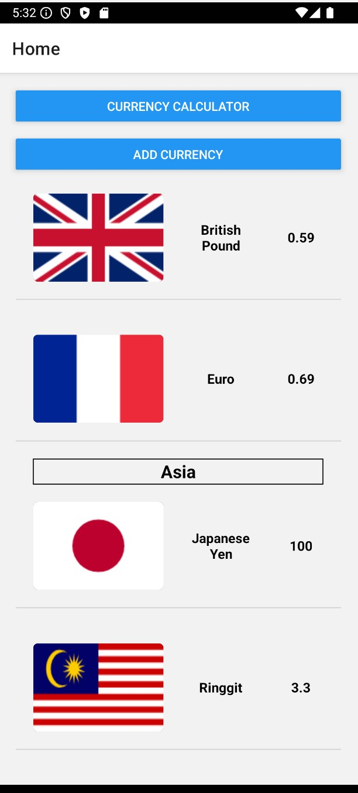
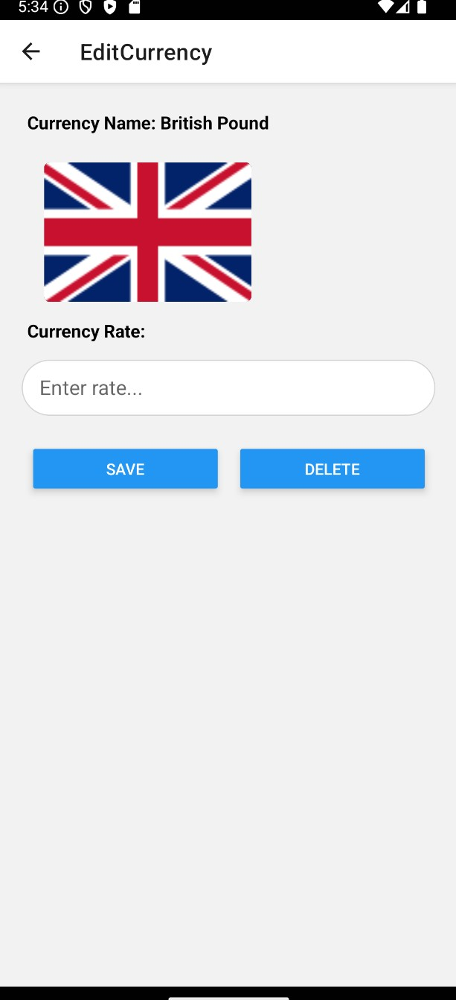
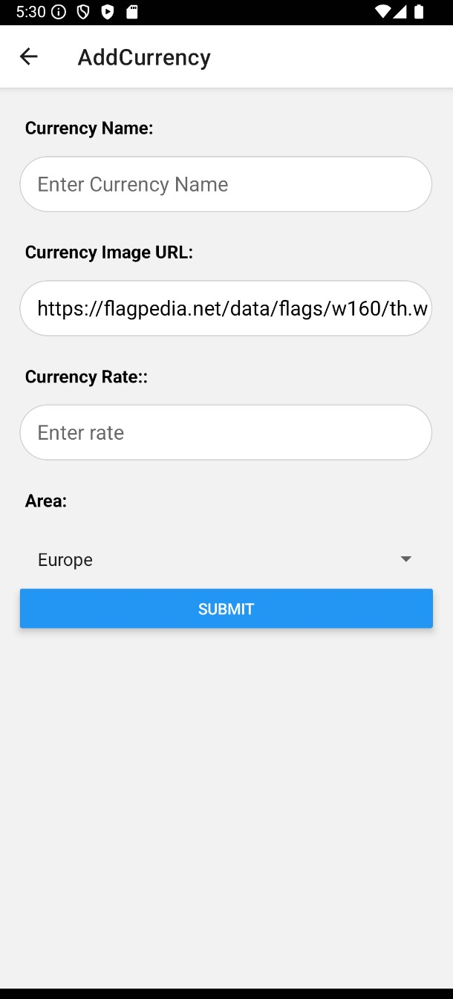
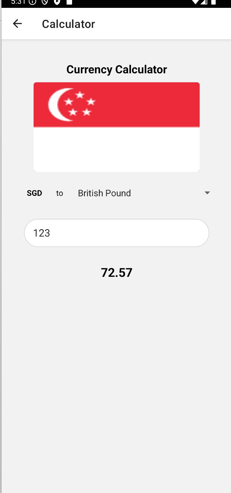

# Hello this is Gaik Hwa's app for the CA submission
 
-----------

## What is this app about?
This app is for currency management and conversion tool that allows users to view exchange rates, 
convert SGD to other currencies, and manage a customizable list of currencies.

### Notable features of the app
Show currencies by region (Europe, Asia) with name, flag, and rate.
Convert SGD to other currencies using a calculator.
Add new currency (name, image, rate, region).
Edit currency from the list.

 
-----------
Lo-fi and High-fi for the app
https://www.figma.com/design/In4LR2sPy6dBHH71tMT5Tw/C346_L07_GaikHwa?node-id=1-174&t=VYYxZhCUDP7NvwC8-1

Screenshots of the app:
Home:

EditCurrency: 

AddCurrency:

Calculator:

Video walkthrough of the app:
https://www.youtube.com/watch?v=V4cp4hZPSmg 

 
------------

Feel free to download this app to your phone:
Link to APK file of the app: 

